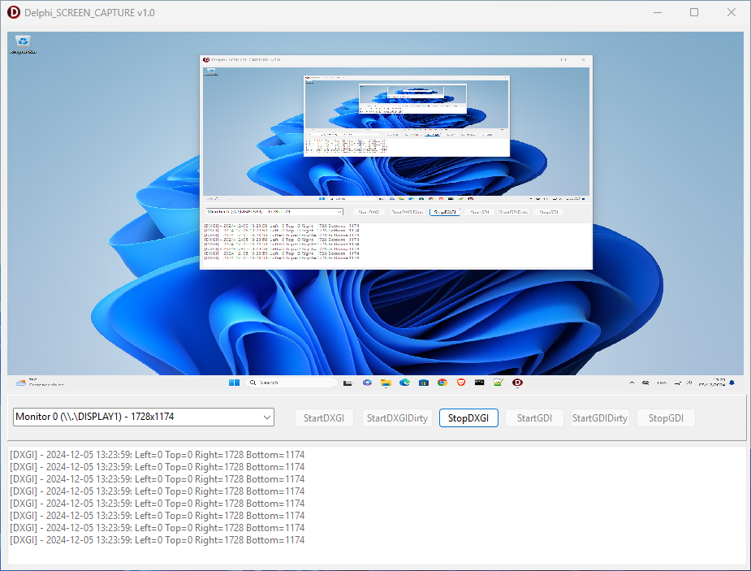

# screen_capture-Delphi

This application demonstrate how to capture screen using Desktop Duplication API or GDI.

- StartDXGI : Capture full screen using Desktop Duplication API.
- StartDXGIDirty : Capture only changed region using Desktop Duplication API.
- StartGDI : Capture full screen using GDI.
- StartGDIDirty : Capture only changed region using GDI. 
 

  

# Contributing

Contributions are welcome! If you have suggestions or bug fixes, please fork the repository and submit a pull request.

Made with ❤️ using Delphi RAD Studio
